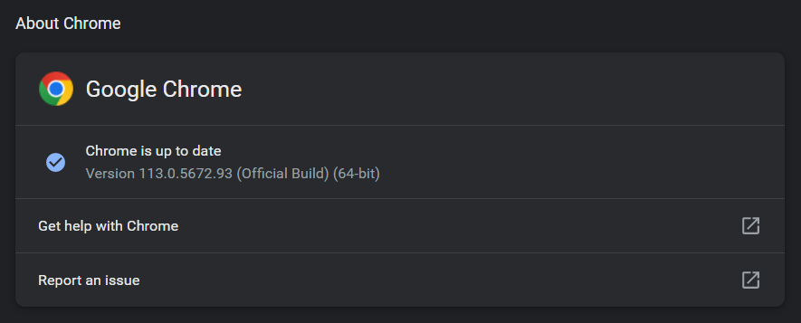
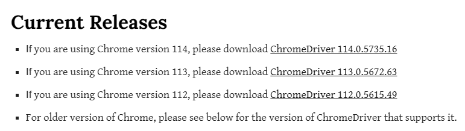

# SlymeGPT 
## About
OpenAI GPT API replication with `selenium webdriver` and `undetectable chromedriver`.  
**NOTE:** Uses Chrome.  
Interacts with the official ChatGPT website and sends responses back to the caller, entirely free of charge (as opposed to the official API).  
Does **NOT** use any endpoints (`forefront`, `theb`, etc.)

## Disclaimer
This program was created for educational purposes only. The user is solely responsible for any actions taken using this program. The creator of this program does not assume any responsibility or liability for any misuse of this program or any damages that may result from the use of this program.

## Setup
This section describes the setup process for `SlymeGPT`.
### Step 1. Download Chrome WebDriver
Open `Chrome -> Settings -> About Chrome`  
to find your Chrome version (update to latest if available).  
  
Then go to https://chromedriver.chromium.org/downloads and download the corresponding version.
  
Add the Chrome WebDriver to your system's PATH variable.
<details>
    <summary>HOW TO ADD TO PATH</summary>
  
    1. Move the downloaded Chrome WebDriver executable to a folder of your choice.
    2. Open your computer's "System Properties" settings.
    3. Click on the "Advanced" tab and then click on the "Environment Variables" button.
    4. Under "System Variables", find the "Path" variable and click "Edit".
    5. Click "New" and add the folder path where the Chrome WebDriver executable is located.
    6. Click "OK" on all open windows to save the changes.
</details>

### Step 2. Config Browser
Change directory to `SlymeGPT`.
In `open_browser.py`, change `profile_name` to a Chrome Profile of your choice, or leave as is to use the default profile.  
The profiles can be found in the the Chrome directory.  
- **Windows**: `C:/Users/[username]/AppData/Local/Google/Chrome/User Data/`  
- **Linux**: `~/.config/google-chrome/`  
- **MacOS**: `~/Library/Application Support/Google/Chrome/`  

After selecting a profile, run `python open_browser.py` to open a Selenium-controlled browser.  
You should see the following screen:  
  
From there, log in to ChatGPT (make sure to enable 'Stay Logged In') and click through any first-time login notifications.  
Once complete, close the window and press ENTER in the CLI (or just terminate `open_browser.py`).

### Step 3. Use Module
The setup is complete. You can now use the module in your program by importing `from slyme import SlymeDriver`.
For a demonstration, see `example.py`, a simple program which takes the user's inputs, forwards them to ChatGPT, and sends the responses back to the user.

### Notes
Please run the module with a **visible UI (not headless)**. The browser window will **automatically minimize** after a few seconds.  
*Attempting to run the module in headless mode or minimizing the browser window manually may result in issues (appears to be a Selenium/UC problem).*

## Functionalities
Below is a code snippet which exhibits and explains each function that comes with the module:
```python
from slyme import SlymeDriver

def main():

    slyme = SlymeDriver(pfname='Default')

    # 1.
    # Selects the latest accessed chat from the user's chat history. 
    slyme.select_latest_chat()

    # 2.
    # Sends a prompt to ChatGPT and returns its response.
    output = slyme.completion(prompt='What does shutil.rmdir("C:/") do?')
    print(output)

    # 3.
    # Renames a past chat.
    slyme.rename_chat(chat_name='Arch Linux', new_name='I use Arch btw')

    # 4.
    # Selects the chat with a matching name.
    slyme.select_chat(chat_name='I use Arch btw')

    # 5.
    # Create a new chat.
    slyme.new_chat()

    # 6. 
    # End the driver session.
    slyme.end_session()

if __name__ == "__main__":
    main()
```

